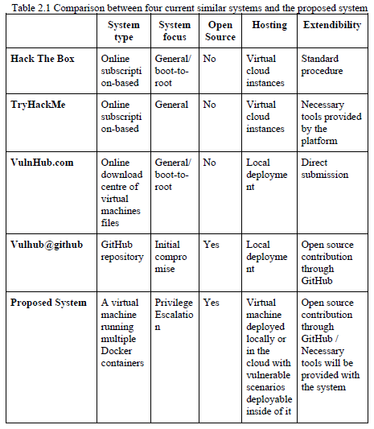

# Chapter 2: Literature Review

In chapter 2, the most important aspect was to relate my project to other existent similar but different projects. Therefore, it was important to perform an analysis of some of the similar systems and compare them to the proposed system. And also provide an overview of the technologies used to develop the system.

## Current System Analysis

I have chosen 4 systems that are currently available and are providing offensive security training in different ways. The systems chosen are:

* [Hack The Box](https://www.hackthebox.eu/)
* [TryHackMe](https://tryhackme.com/)
* [Vulnhub.com](https://www.vulnhub.com/)
* [Vulhub@GitHub](https://github.com/vulhub/vulhub)

The funny thing is that I knew about Vulhub GitHub repository only after I have finished chapter one. I was honestly quite shocked because I thought the idea I had for my project implementation using docker is unique, however, I found the implementation of Vulhub is quite similar, however, it doesn't provide any privilege escalation training scenarios while my project is only focused on that.

## Current System Comparison

I performed a thorough comparison between the current systems I have discussed and the proposed system. This was based on a number of criteria which were as follows:

* System Type
* System Focus
* Open Source
* Hosting
* Extendibility

|  | 
|:--:| 
| *Current System Comparison* |

## Technologies Used

The technologies used to build the project will be as follows

* Docker
To configure and build the environment of the simulated training scenarios.
*Django Framework
Python-based web framework to create the web application to interact with the training scenarios.
Vagrant:
To configure and build the virtual machine that will package both the training scenarios and the web application.

## Chapter 2 Discussion

After preparing chapter 2, it was time to receive my supervisor's comments and suggestions about it. Following the suggestions I received, I think this chapter went alright. I also received feedback from Miss Hazinah that she has enjoyed reading the chapter, which I don't think is an easy thing to accomplish. Another thing to be proud of. Hooray!
