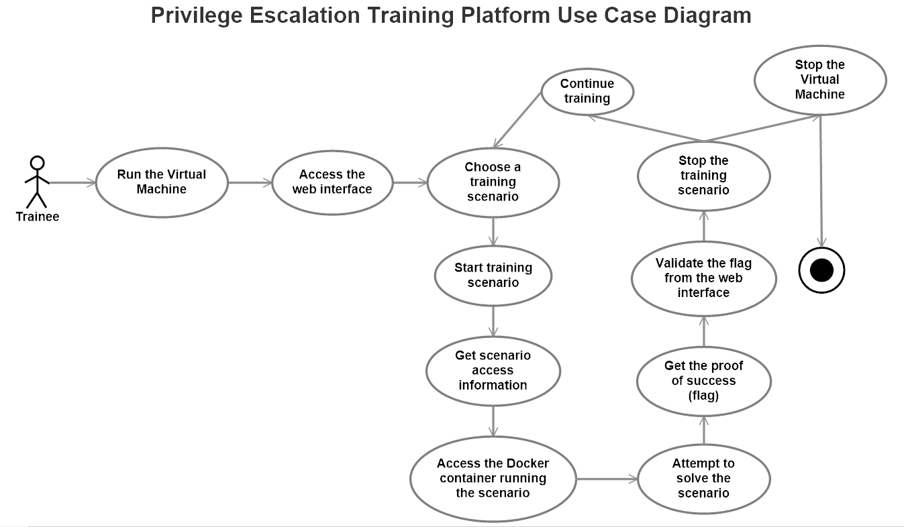
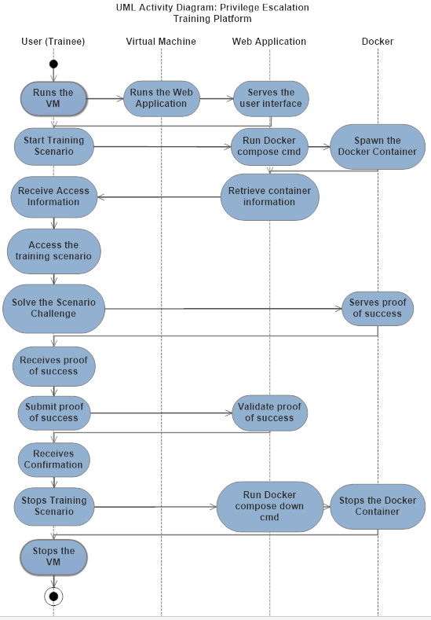
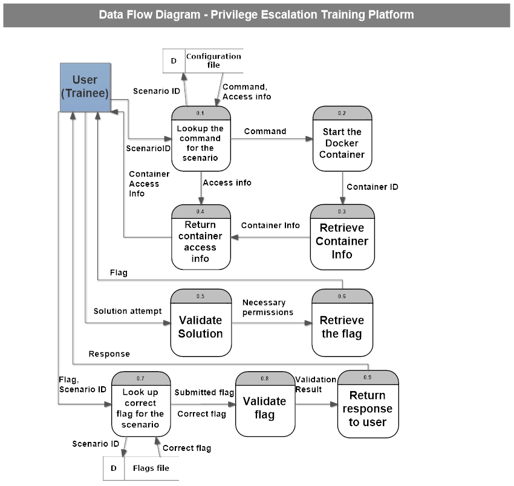
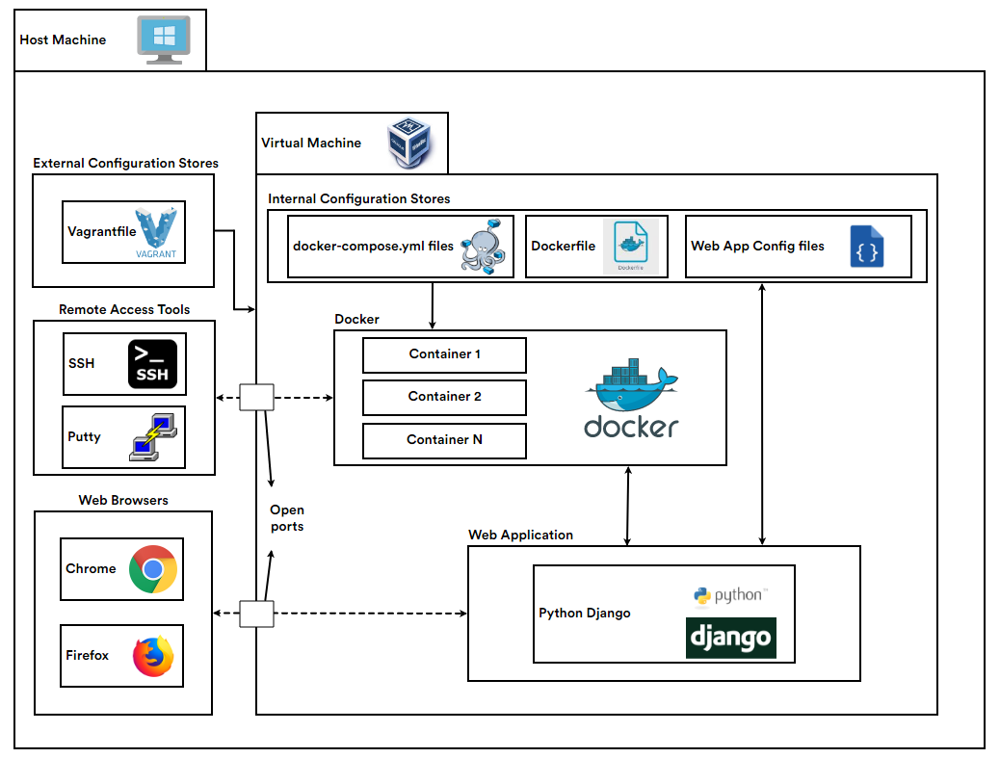
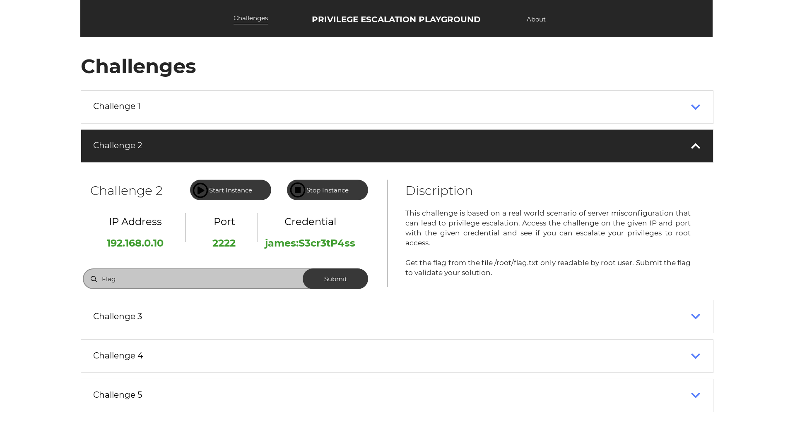

# Chapter 4: Requirement Analysis and Design

In this chapter, I was expected to design the actual system and its requirements. This includes designing the use-case of the system, the activities performed by the system's elements, and data flow between them. In this chapter, I will also need to design the system architecture and to prototype the user interface.

I had to use different modeling tools to design different diagrams that reflect my understanding of the system. I used SmartDraw for all diagrams except for the architecture diagram I used Terrastruct and for the user interface, I used Proto.io.

## Use Case Diagram

|  | 
|:--:| 
| *Use Case Diagram* |

## Activity Diagram

|  | 
|:--:| 
| *Activity Diagram* |

## Data Flow Diagram

|  | 
|:--:| 
| *Data Flow Diagram* |

## System Archticture Diagram

|  | 
|:--:| 
| *System Archticture Diagram* |

## User Interface Design

|  | 
|:--:| 
| *User Interface Design* |

## Chapter 4 Discussion

This chapter was all about diagrams. How deep is my understanding of the system and how well I can illustrate that. After getting this all done with some tedious design effort, it was time to receive my supervisor's comments about it. Thankfully, Miss Hazinah didn't have any criticism about my diagrams, only minor mistakes in the report were pointed out and I could deal with them soon after.
