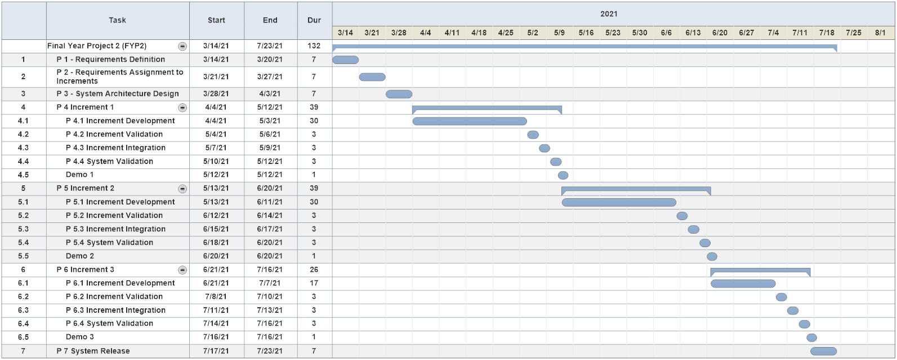

# Chapter 5: Conclusion

In this chapter, I'm basiclly expected to summrize my whole project restating its importance and objectives, state the achivements that I've reached so far and describe how I'm planning to proceed with the actual development next year.

## Initial Acheivements

System design and architecture are basically  complete. The achievments that I have reached so far were as follows:

1. An overview of the whole system has been planned and designed.
2. System Requirements have been identified and assigned to increments.
3. System architecture has been designed.
4. System user interface design has been prototyped.

## FYP2 Execution Plan

The development process will be done over three iterations, delivering one increment every iteration. Upon completion of every increment it will be integrated with the whole system. The system will be tested and validated after each increment.

The execution plan will follow the Iterative and Incremental Development methodolgy as outlined by the Gantt Chart (Drawn with SmartDraw, quite nice).

|  | 
|:--:| 
| *FYP2 Execution Plan Gantt Chart* 

## Chapter 5 Discussion

Since this's the last chapter of FYP1, few comments where received from my supervisor. This was my last discussion with Miss Hazinah about the report. I believe she thought my project is OK, I hope the examiners think so too.