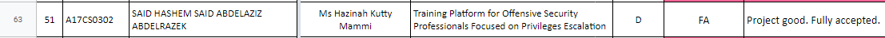

# Project Proposal

After deciding the title it's time to shape the idea by defining the problem background and what is the proposed solution going to be. This includes defining the objectives and scope of the project.

## Proposal Preparation

I have prepared the project proposal as well as the needed forms ready to be discussed with Miss Hazinah. The proposal stated the problem as well as my proposed solution for it. It also contained a list of the project objectives, scope and requirements.

|  | 
|:--:| 
| *Project Requirements* |

## Proposal Discussion

I had a discussion with my supervisor, Miss Hazinah, about the proposal I have prepared. The discussion has resulted in a lot of corrections and adjustments. After making the suggested corrections the project was ready to be presented in front of the evaluators commitee.

## Proposal Presentation

I have presented my project idea in front of the the evaluators comittee and it went great. They didn't have any critisizm about the project except for the wording of the title. The only comment on the title was about the word "Proffisional", the argument was that a training platform won't be mainly meant for profissional, it will be for students and offensive security personell with different skill levels. It made sense to me so I decided to get rid of the word alltogether. With the help of my supervisor we decided to proceed with the new title "Privilege Escalation Focused Offensive Security Training Platform".

|  | 
|:--:| 
| *Single-Slide Project Presentation* |

## Presentation Result

Soon after, the presentation results came out and thankfully my project has passed with flying colors. That was something to be proud of given how much critisim other projects have received from the evaluators.

|  | 
|:--:| 
| *Single-Slide Project Presentation* |
